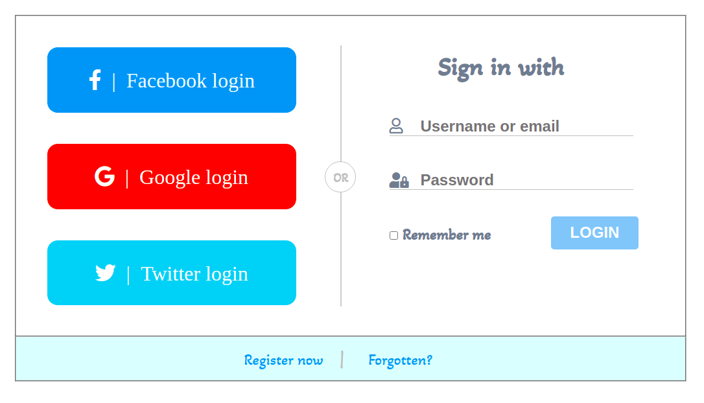

# Login App

## Table of Contents

### About The Project

**Login form**

Prepared a Login form with HTML and CSS to practice and to prepare a login form for Backend.
To be Updated...

- Built With
  - HTML;
  - CSS;

### Getting Started

- Prerequisites
  - vsCode;

### Usage

- HTML;
- CSS;
- Google fonts;
- Fontawesome.

### Contributing

## Iulian Stan

### License

- Copyright protected

### Contact

[**Iulian Stan**](https://github.com/iulianSta)

### Acknowledgement

### I want to thank to the [**DCI**](https://www.digitalcareerinstitute.org) team and teachers!
